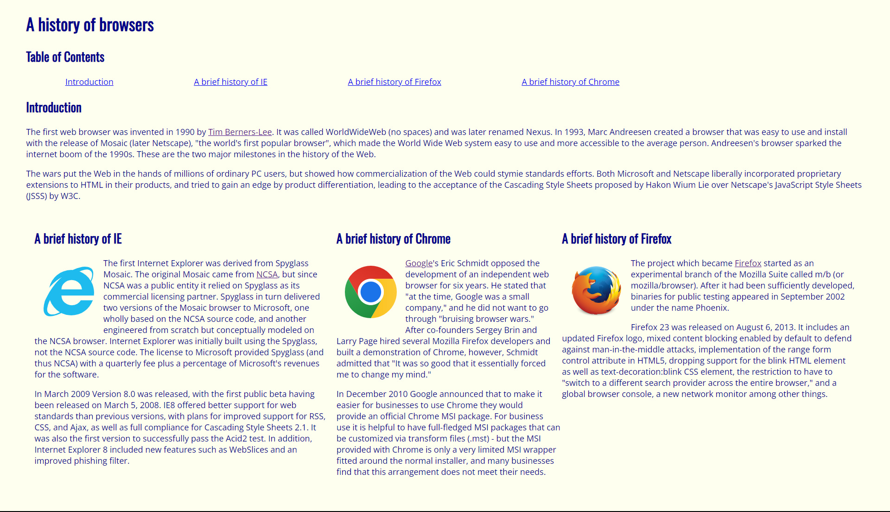
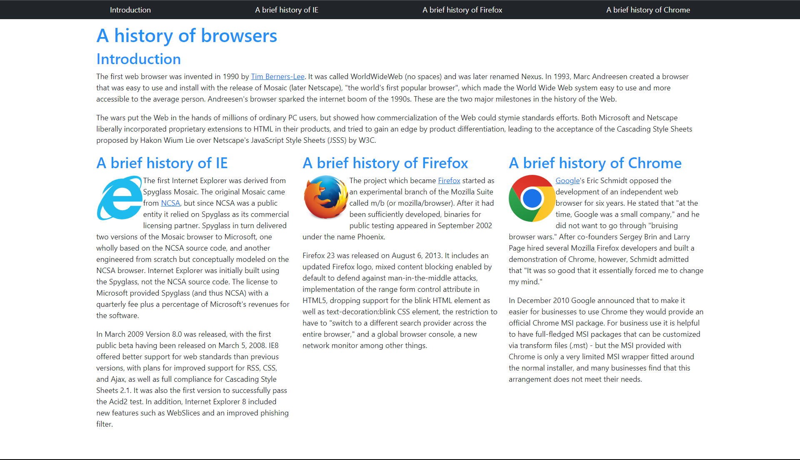

## Introduction

Builing a website with CSS and HTML alone can be a very tedious task. It can take a lot of time to make a website look good and function properly. However, there are tools that can make this process much easier. One of these tools is Bootstrap. Bootstrap is a UI framework that allows you to easily make a website look good and function properly. It does this by providing you with a library of CSS and HTML classes that you can use to style your website. This makes it much easier to make a website look good and function properly. The learning curve might be steep with the multitude of classes that Bootstrap provides, but once you get the hang of it, it can be a very useful tool.

## Raw HTML and CSS Vs Bootstrap

The first image is of a website made using raw HTML and CSS, the second image is a redesign of the same website using Bootstrap. The key difference between these websites are how the navigation links are made. Boostrap gave the tools necessary to create the navigation bar seen at the top of the site with ease. Another difference is seen more in the background, the raw code itself, and that is how the sections are split into columns. With bootstrap this is done with a simple class, but without bootstrap this would require a lot time to adjust it to add more content or remove. 

## Conclusion
Bootstrap is a very useful tool that can make the process of making a website much easier. It provides you with a library of commonly frequently used UI designs in the form of classes. With bootstrap, website creation is much easier and faster. The flexibility in the implementation of Bootstrap also allows for websites to be updated and changed overtime without needing a full redesign. It is a tool that I will definitely be using in the future.