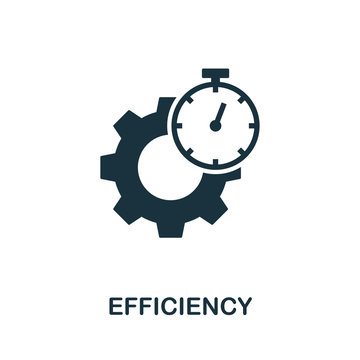

## Foundation

My passion for programming is to make common tasks simpler or completely automated. This all started with my love for video games as a child. I would love to figure out game mechanics and find the most optimal ways to complete a game or compete against others. This always drove me towards any type of machinery in games that allowed me to automate a task like collecting a resource or making something. I would also delve deep into the numbers and statistics for many of these games to make sure everything I did was optimized. This formed the basis of what I liked about computers and their ability to consistently perform some tasks more efficiently than a person could.

## Interests

When working with software, I primarily like programming embedded systems. I like being able to take live data from various sensors and do something with it. Primarily, what I find the most interesting is robotics. Taking that live data, analyzing the data, and using a machine to affect a physical object always gives me a sense of excitement. I also like taking data and using it in a purely digital environment like research analysis, but to me, nothing compares to seeing something physically move because of my code.

## Future

Building on my interests in automation, I also like artificial intelligence and machine learning. I have dabbled with using machine learning in my projects, but I would like to learn more about it. The idea that a machine or computer can perform tasks with endless variability that normally could only be performed by a human is fascinating. Being able to create programs that can adapt and learn without every possibility of being hard coded is really exciting to me.
