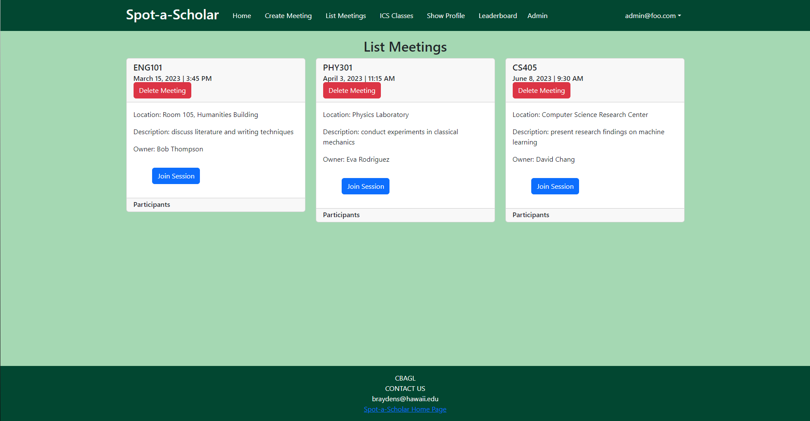

Spot-A-Scholar is a web application developed for a software engineering class. This web application was made as a platform for students to create and organize study sessions with each other. This web application was made using Meteor, MongoDB, and Bootstrap. This project was done as a team of 5.

In this project, I was responsible for creating the page that would display the list of all available meetings and the admin version of that page. Besides showing all the available meetings, this page also allowed users to join them and would display the participants that had signed up for each meeting. As for the admin version of the page, it had the same functionality as the user version with the additional option to delete meetings. Additionally, I helped out with setting up the navigation bar to only show up if the user was logged in. To make these possible I had to create a basic schema for the participants collection and access both the meetings collection and the participants collection. I also had to create buttons that would allow users to join meetings and allow admins to delete meetings.

This project taught how to work effectively as a team when creating a web application, as we delegated different pages and backend work to different members. It allowed me to apply what I learned about Meteor, Bootstrap, and MongoDB to a practical application. It also improved my knowledge of how to use GitHub to collaborate with others on a project in a more efficient way, with the use of organizations, projects, and issues.

This image is of the admin version of the meeting list page.

  

Learn more about how to use Spot-A-Scholar [here](https://spot-a-scholar.github.io/).

You can find the source code [here](https://github.com/spot-a-scholar).