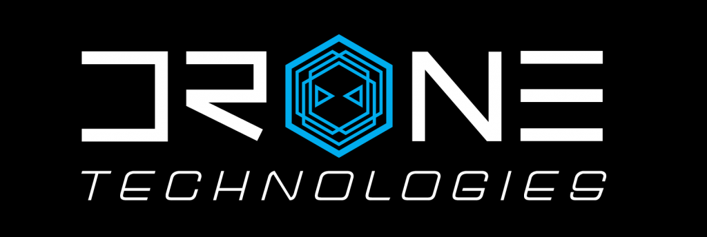

The University of Hawaii Drone Technologies(UHDT) is a Vertically Integrated Project(VIP) which is a multidisciplinary team consisting of mechanical, electrical, and computer engineers. The Student Unmanned Aerial Systems Competition(SUAS) is an annual competition hosted by the Association for Unmanned Vehicle Systems International(AUVSI). In this competition, drones are tasked with autonomously navigating a course and completing a series of tasks. The tasks include autonomously traversing a series of waypoints, identifying and locating targets, and dropping payloads cooresponding to each target. This is done as a simulated mission of package delivery to a remote location.


For this project, our team was split up into several subsystems each assigned to different ascpects of the drone system. I was the lead of the Image Proccesing subsystem. My subsystem was tasked with creating an autonomous system to identify and locate targets on the ground using the drone's camera. This was done using a combination of computer vision and machine learning.


The payload is a water bottle with a description of the target on it's label. These bottles must be dropped on the coorsponding target within a 15 feet radius. Targets are characterized by their shape, color of the shape, alphanumeric, and color of the alphanumeric. This is accomplished with a combination of object detection, shape recognition, color recognition, and alphanumeric recognition algorithms. The object detection and shape recognition algorithms are made using YOLOv5, a common machine vision library. Color recognition was made using the K-means clustering, a data analyzation technique. Alphanumeric recognition was made using the Tesseract OCR library. These algorithms were trained on a custom artificial dataset we made using a Python script, the script was also made to generate a label file for each image. A script then is used to take the results of the algorithms combined with drone sensor data embedded into the image to determine the location of the target as GPS coordinates. A final script uses the results of the previous script to create a waypoint file for the drone to follow to drop the payloads.

Here is the main file that runs all the algorithms:

```cpp
byte ADCRead(byte ch)
{
    import os
    import cv2
    from PIL import Image
    import time
    from ColorRec import color_rec_large as CRL
    from AlphanumRec import image2textConf as AR
    from ObjectDetection import ObjectDetection
    from ObjectDetection import class_to_shape
    import TargetClass
    from metadataExtractor2 import extractMetadata as dataExtract
    from payloadDelivery import deliveryScript as deliveryScript
    from Geotag import geotag as geotag
    from Geotag import haversine as distance
    from Close_Enough_Test_Cases_Test import order_payloads as match

    #Payload 1 Info
    dock1 = 9
    shape1 = "HEXAGON"
    shapeColor1 = "GREEN" 
    alphanumColor1 = "YELLOW"
    alphanum1 = "7"

    #Payload 2 Info
    dock2 = 10
    shape2 = "RECTANGLE"
    shapeColor2 = "WHITE" 
    alphanumColor2 = "YELLOW"
    alphanum2 = "P"

    #Payload 3 Info
    dock3 = 11
    shape3 = "CIRCLE"
    shapeColor3 = "BROWN" 
    alphanumColor3 = "ORANGE"
    alphanum3 = "3"

    #Payload 4 Info
    dock4 = 12
    shape4 = "OCTAGON"
    shapeColor4 = "RED" 
    alphanumColor4 = "ORANGE"
    alphanum4 = "T"

    #Payload 5 Info
    dock5 = 13
    shape5 = "CIRCLE"
    shapeColor5 = "PURPLE" 
    alphanumColor5 = "GRAY"
    alphanum5 = "T"

    pic_count = 27
    count = 0
    targetList = []
    payloadlist = []
    imagelist = []
    path = 'watchdog'
    trash = 'old'
    config = {
          'image_width': 6000,
          'image_height': 4000,
          'resolution': 3.91e-9
          }
    for x in range(0, pic_count+1):
        imagelist.append(f'image{x}.jpg')
    def watch_directory():
        count = 0
        print("File Watcher Initiated")
        while (len(targetList) < 4) and (count < pic_count):
            for filename in os.listdir(path):
                if len(os.listdir(path)) > 1 and (filename in imagelist):
                    if filename.endswith(".jpg") or filename.endswith(".jpeg") or filename.endswith(".png"):
                        full_path = os.path.join(path, filename)
                        # Wait until the file is fully created
                        while True:
                            if os.path.exists(full_path) and os.path.getsize(full_path) > 0:
                                break
                            time.sleep(1)
                        # Process the image file
                        ODCL(full_path)
                        # Delete the image file
                        os.remove(full_path)
                        count +=1    
            time.sleep(1) # Check directory every __ seconds
        if(len(targetList) >= 4) or (count >=pic_count):
            matched_list = match(payloadlist, targetList)
            deliveryScript(targetList, matched_list)

    def ODCL(source):
        start_time = time.time()
        image = Image.open(f'{source}')

        #Object Detection and Shape Recogntion Function Call
        pitch, yaw, roll, latitude, longitude, altitude = dataExtract(source)
        metadata = [pitch, yaw, roll, latitude, longitude, altitude]
        results, bboxes = ObjectDetection(image)

        for bbox in bboxes:
            #Get Bounding Box and Shape Classification of Found Target
            x1, y1, x2, y2, conf, type = bbox
            x1, y1, x2, y2 = int(x1), int(y1), int(x2), int(y2)
            target_area = (x1+x2)*(y1+y2)

            if target_area > 82000:
                #Geotag Target
                xMid,yMid = (x1+x2)/2, (y1+y2)/2
                latitude, longitude = geotag(config, metadata, xMid, yMid)
                print(f"Lat:{latitude}, Long:{longitude}")

                #Check if duplicate Target
                if not targetList or all(abs(distance(target.latitude, target.longitude, latitude, longitude)) > 3 for target in targetList):
                    #Crop Target from Image
                    cropped = image.crop((x1,y1,x2,y2))
                    #cropped.show()

                    shape = class_to_shape(type)
                    print(shape)

                    #ColorRecLarge Function Call
                    alphanum_string, shape_string, filtered1, filtered2 = CRL(cropped)

                    print(shape_string)
                    print(alphanum_string)

                    #Alphanumeric Recognition Function Call
                    alphanum = ""
                    alphanum1, alphanum_conf1 = AR(filtered1)
                    alphanum2, alphanum_conf2 = AR(filtered2)
                    if alphanum_conf1 > alphanum_conf2:
                        alphanum = alphanum1
                    else:
                        alphanum = alphanum2
                    print(alphanum)

                    NewTarget = TargetClass.Target(shape, latitude, longitude, shape_string, alphanum_string, alphanum)
                    targetList.append(NewTarget)
        end_time = time.time()
        print(f"Runtime:",end_time - start_time)

    payload1 = TargetClass.Payload(dock1, shape1.upper(), shapeColor1.upper(), alphanumColor1.upper(), alphanum1.upper()); payloadlist.append(payload1); print("Payload 1 Added")
    payload2 = TargetClass.Payload(dock2, shape2.upper(), shapeColor2.upper(), alphanumColor2.upper(), alphanum2.upper()); payloadlist.append(payload2); print("Payload 2 Added")
    payload3 = TargetClass.Payload(dock3, shape3.upper(), shapeColor3.upper(), alphanumColor3.upper(), alphanum3.upper()); payloadlist.append(payload3); print("Payload 3 Added")
    payload4 = TargetClass.Payload(dock4, shape4.upper(), shapeColor4.upper(), alphanumColor4.upper(), alphanum4.upper()); payloadlist.append(payload4); print("Payload 4 Added")
    payload5 = TargetClass.Payload(dock5, shape5.upper(), shapeColor5.upper(), alphanumColor5.upper(), alphanum5.upper()); payloadlist.append(payload5); print("Payload 5 Added")

    watch_directory()
}
```

The full code can be found here: <a href="https://github.com/Ng-Gavin/Ng-Gavin.github.io">UHDT-ODCL</a>
